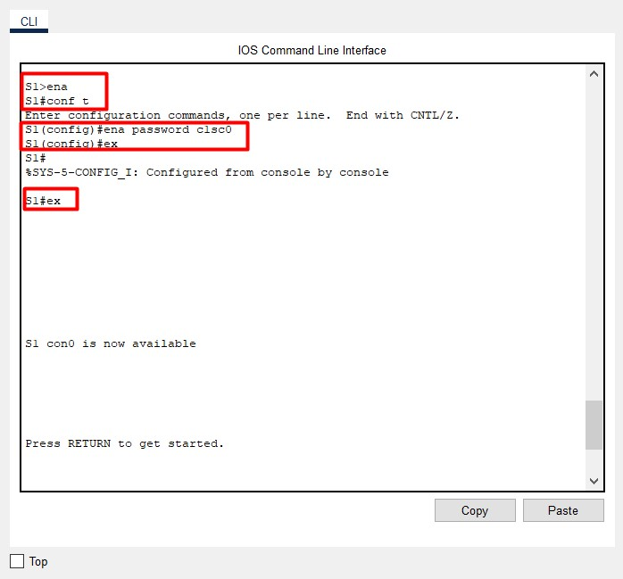
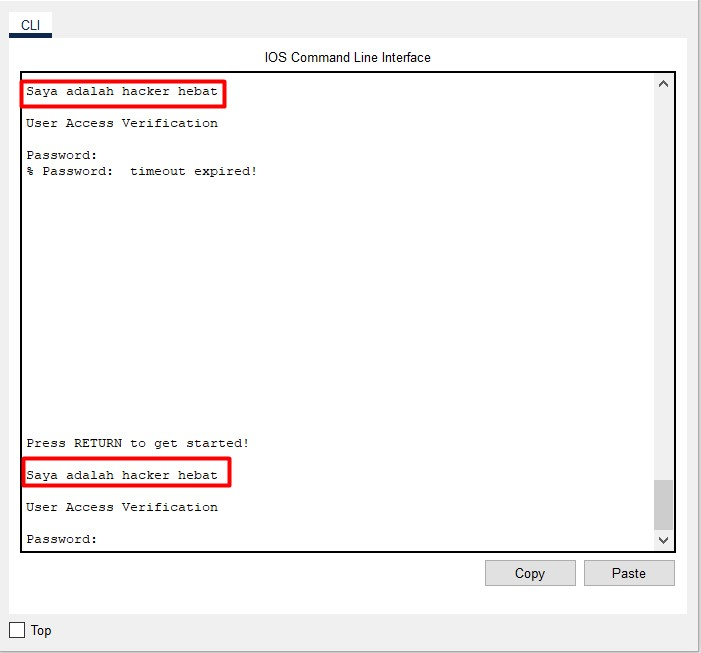

# Packet Tracer - Konfigurasikan Pengaturan Switch Awal

  

## Objektif
### Part 1: Verifikasi Konfigurasi Switch Default
### Part 2: Konfigurasikan Konfigurasi Switch Dasar
### Part 3: Konfigurasikan banner MOTD
### Part 4: Simpan File Konfigurasi ke NVRAM
### Part 5: Konfigurasi S2

## Instruksi
### Part 1: Verifikasi Konfigurasi Switch Default
#### Anda dapat mengakses semua perintah peralihan dari mode EXEC yang diistimewakan. Namun, karena banyak perintah istimewa yang dikonfigurasi parameter operasi, akses istimewa harus dilindungi kata sandi untuk mencegah penggunaan yang tidak sah. konfigurasikan perintah yang melaluinya akses ke mode konfigurasi diperoleh. Untuk mengkonfigurasi bisa dilihat gambar bawah ini:

### Part 2: Konfigurasikan Konfigurasi Switch Dasar
#### Kita atur parameter switch terlebih dahulu, Untuk mengkonfigurasi bisa dilihat gambar bawah ini:

#### Untuk mengamankan akses consol line, kita atur password nya. Untuk mengkonfigurasi bisa dilihat gambar bawah ini:

#### Lalu Keluar dari mode istimewa untuk memverifikasi bahwa kata sandi port konsol berlaku.

#### Setel kata sandi pengaktifan ke c1sc0. Kata sandi ini melindungi akses ke mode istimewa.

#### Masukkan perintah `exit`  untuk keluar dari switch, dan Anda sekarang akan dimintai kata sandi. Kata sandi pertama adalah kata sandi konsol yang Anda konfigurasikan untuk baris con 0.

#### Kata sandi pengaktifan harus diganti dengan kata sandi rahasia terenkripsi yang lebih baru menggunakan perintah `enable secret`. Mengatur aktifkan `enable secret` menjadi `itsasecret`. Masukkan perintah show running-config lagi untuk memverifikasi bahwa kata sandi rahasia pengaktifan baru telah dikonfigurasi.

#### `enable secret` pengaktifan telah dienkripsi, tetapi kata sandi `enable` dan `console` masih tetap jelas teks. Kami sekarang akan mengenkripsi kata sandi teks biasa ini menggunakan perintah `service password-encryption`.

### Part 3: Konfigurasikan banner MOTD
#### Kumpulan perintah Cisco IOS mencakup fitur yang memungkinkan Anda mengonfigurasi pesan yang dilihat oleh siapa pun yang masuk ke switch. Pesan-pesan ini disebut pesan hari ini, atau spanduk MOTD. Lampirkan teks spanduk dalam tanda kutip atau gunakan pembatas berbeda dari karakter apa pun yang muncul di string MOTD.

### Part 4: Simpan File Konfigurasi ke NVRAM
#### Simpan file konfigurasi. Anda telah menyelesaikan konfigurasi dasar sakelar. Sekarang buat cadangan file konfigurasi yang sedang berjalan ke NVRAM untuk memastikan bahwa perubahan yang dilakukan tidak hilang jika sistem di-boot ulang atau kehilangan daya.

### Part 5: Konfigurasi S2
#### Anda telah menyelesaikan konfigurasi pada S1. Anda sekarang akan mengkonfigurasi S2. Jika Anda tidak dapat mengingat perintahnya, lihat Bagian 1 hingga 4 untuk bantuan.
#### Konfigurasikan S2 dengan parameter berikut:
#### Buka Jendela Konfigurasi untuk S2
#### A. Nama perangkat: S2
#### B. Lindungi akses ke konsol menggunakan kata sandi `monaco`.
#### C. Konfigurasikan kata sandi pengaktifan c1sc0 dan kata sandi `itsasecret` pengaktifannya.
#### D. Konfigurasikan pesan yang sesuai untuk mereka yang masuk ke switch.
#### e. Enkripsi semua kata sandi teks biasa.
#### F. Pastikan konfigurasinya benar.
#### G. Simpan file konfigurasi untuk menghindari kehilangan jika saklar dimatikan.
